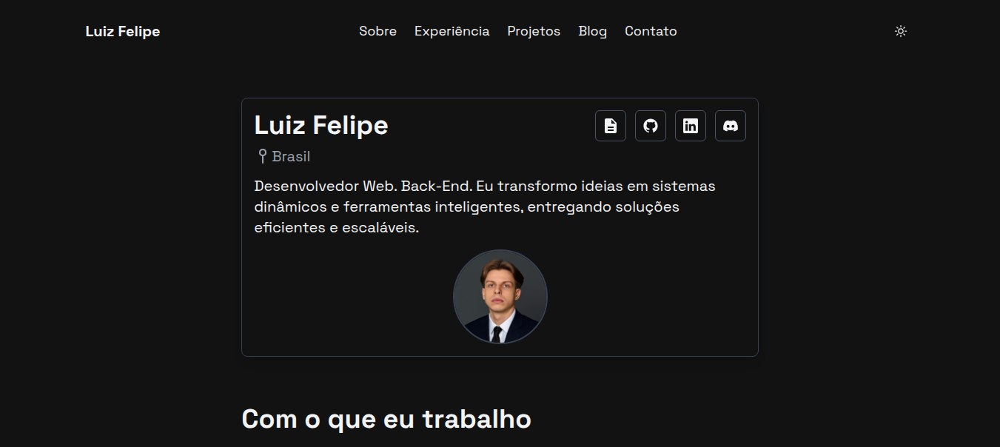
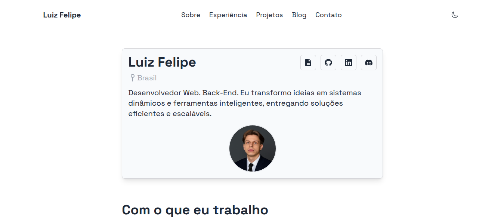

# 🚀 Meu portfolio-blog em PHP e MySQL


---

## Descrição

Portfolio + Blog pessoal desenvolvido em PHP puro e MySQL, com painel administrativo para gerenciar conteúdos sobre mim, minhas experiências, projetos, blog e contato. O projeto é integrado a banco de dados e baseado em um layout original criado por outro autor (com créditos devidamente atribuídos). Todo o backend foi reescrito em PHP, substituindo a implementação inicial em Hugo.

Este projeto demonstra habilidades em PHP, JavaScript e MySQL, aplicando conceitos de CRUD (Create, Read, Update, Delete) para persistência e gerenciamento de dados nos painéis administrativos, permitindo criar, visualizar, atualizar e deletar informações de forma prática e organizada

----

## 🛠️ Tecnologias Utilizadas

- **PHP 8.2**
- **MySQL**
- **JavaScript**
- **Tailwind**
- **HTML5**
- **CSS3**
- **Servidor local (XAMPP)**

---

## ⚙️ Funcionalidades

- ✅ Publicar, editar e excluir posts via painel administrativo;  
- ✅ Gerenciar conteúdo armazenado em banco de dados MySQL; 
- ✅ Navegar pelos posts no frontend de forma organizada; 
- ✅ Layout moderno e personalizável.  
- ✅ Modo escuro e Modo claro.  
- ✅ Interface limpa e responsiva  

---

## 📁 Estrutura do Projeto

```
meu-blog-portfolio/
│
├── admin/
│   └─ assets/    -> CSS
│   └─ includes/ 
│   │        └── auth.php
│   │        └── config.php
│   │        └── footer.php
│   │        └── header.php
│   │        └── logout.php
│   └─ pages/
│   │   └─ blog/ 
│   │   │   └── auth.php
│   │   │   └── config.php
│   │   │   └── footer.php
│   │   │   └── header.php
│   │   │   └── logout.php
│   │   └─ contato/ 
│   │   │   └── cadastrar_contato.php
│   │   │   └── editar_contato.php
│   │   └─ experiencias/ 
│   │   │   └── cadastrar_experiencia.php
│   │   │   └── deletar_experiencia.php
│   │   │   └── editar_experiencia.php
│   │   │   └── lista_experiencia.php
│   │   └─ projetos/ 
│   │   │   └── cadastrar_projeto.php
│   │   │   └── deletar_projeto.php
│   │   │   └── editar_projeto.php
│   │   │   └── lista_projetos.php
│   │   └─ sobre/ 
│   │       └── cadastrar_sobre.php
│   │       └── editar_sobre.php
│   │       
│   ├─ dashboard.php     -> Dashboard do painel administrativo
│   ├─ index.php     -> Redireciona para login.php
│   └─ login.php    -> Tela de login para acessar painel
│   
├── assets/
│   └─ css/
│   │   └── style.css
│   └── images/
│   |   └── pictureprofile.png
│   └── js/
│       └── script.js
│   
├── blog_post/
│   └── post.php    -> Pagina de exibicao de posts cadastrados no bd
│     
├── images/    -> Images do projeto
│   └── imageportfolio.png  
│       
├── includes/
│   └── .htacess   -> bloquear que usuários acessem diretamente arquivos do /include pelo navegador.
│   └── conexao.example.php     -> modelo de conexao com bd
│   └── conexao.php
│   └── footer.php
│   └── header.php
│   └── upload.php
│   └── script.sql    -> codigo sql para criar o bd
│       
├── .htacess
├── about.php
├── blog.php
├── contact.php
├── experience.php
├── index.php
├── LICENSE
├── projects.php
└── README.md
```

## 🧩 Como Usar o Projeto:

### Pré requisitos
- **PHP 8+** 
- **GIT**
- **Servidor local (XAMP, LAMPP, WAMP..)**
- **MySQL ou MariaDB**

### Etapas como usar:

#### 1. Clone este repositorio
```bash
git clone https://github.com/luizz-costa/meu-blog-portfolio.git
```

#### 2. Coloque a pasta dentro do diretório do seu servidor local
- htdocs (XAMPP)
- WWW (Laragon)

#### 3. Abra no navegador
`http://localhost/meu-blog-portfolio`

#### 4. Importar o Banco de Dados
> A conexão com o banco é feita através da extensão MySQLi.
> Compatível com **MySQL** e **MariaDB**.  
> Outros SGBDs (como PostgreSQL) podem precisar de ajustes no script SQL em /includes e na conexão com banco de dados.

1. Crie um banco de dados no MySQL e de um nome Ex: `portfolio_blog`.
2. Clique em **Importar** e selecione o arquivo `script.sql` em /includes.
3. Clique em **Executar ou Importar**.

#### 5. Terminal MySQL
```bash
mysql -u USUARIO -p NOME_DO_BANCO < caminho/para/script.sql
```

#### 6. Configuração do Banco de Dados

1. Renomeie o arquivo `conexao.example.php` para `conexao.php`.
2. Preencha os valores corretos do seu banco de dados:
   - `$host` → endereço do servidor MySQL
   - `$user` → usuário do banco
   - `$pass` → senha do usuário
   - `$db`   → nome do banco de dados Ex: `portfolio_blog`

3. Os includes ja estão sendo feitos nas paginas com require_once('includes/conexao.php');
4. Salve e rode o projeto localmente (XAMP, etc).
5. Abra no navegador `http://localhost/meu-blog-portfolio`

---

## 🔹Endpoints

### Blog

- **Cadastrar Postagem:** POST `admin/pages/blog/cadastrar_post.php`  
  Parâmetros: `title`, `link_post`, `technologies`, `short_description`, `long_description`, `image`

- **Atualizar Postagem:** POST `admin/pages/blog/editar_post.php`  
  Parâmetros: `id`, `title`, `link_post`, `technologies`, `short_description`, `long_description`, `image`

- **Deletar Postagem:** POST `admin/pages/blog/deletar_post.php`  
  Parâmetro: `id`, `confirm`

- **Listar Postagens:** GET `admin/pages/blog/lista_posts.php`  
  Parâmetros: Nenhum

---
## 📷 Preview

#### Index em modo Dark


#### Index em modo Claro


---

## 📄 Licença

Este projeto está sob a licença MIT.
Sinta-se livre para usar, modificar e compartilhar.

---


## ⚡ Contato

> 👨‍💻 **Desenvolvido por [Luiz F. Costa](https://luizzcosta.site)**  
> 🌐 Portfólio: [luizzcosta.site](https://luizzcosta.site)  
> 💻 GitHub: [github.com/luizz-costa](https://github.com/luizz-costa)  
> 💼 LinkedIn: [linkedin.com/in/luizz-costa](https://linkedin.com/in/luizz-costa)  
> 📧 Email: [luizcostavzp@gmail.com](mailto:luizcostavzp@gmail.com)

---


Layout baseado no tema [Hugo Noir](https://themes.gohugo.io/themes/hugo-noir/) de [Pranam Shetty](https://github.com/prxshetty), licenciado sob MIT. Backend em PHP/MySQL desenvolvido por Luiz Felipe.